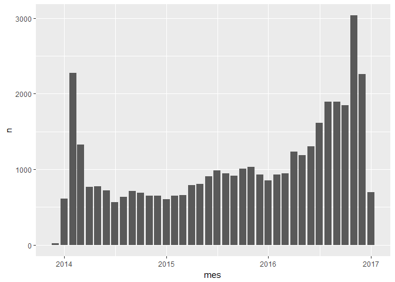
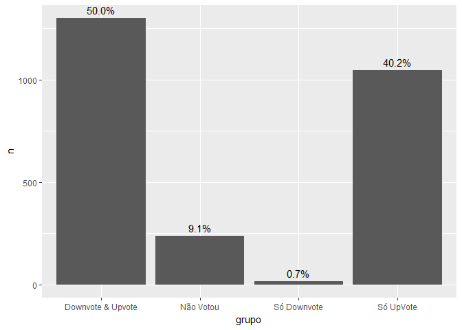
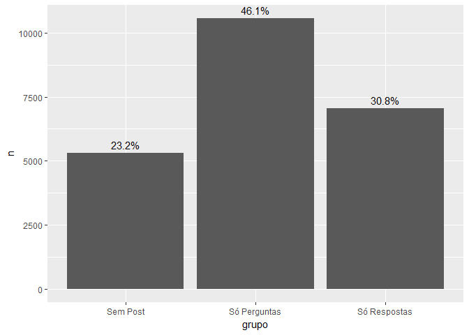
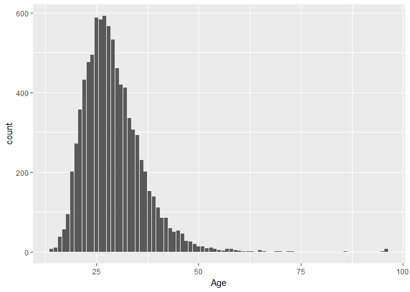
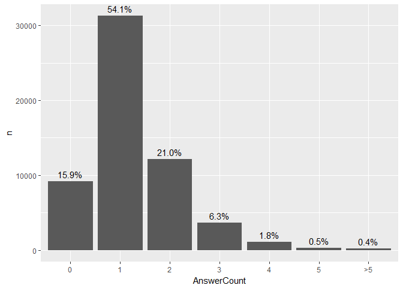
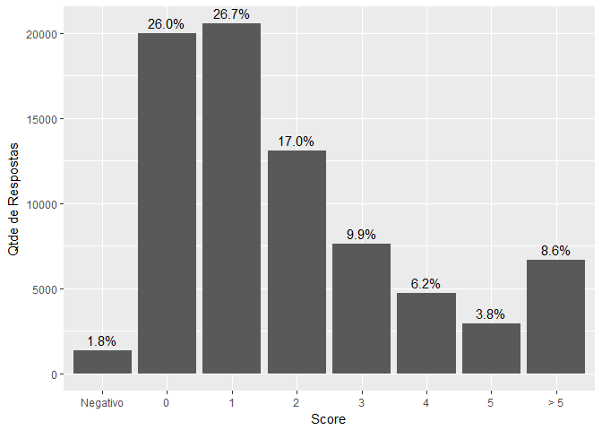

# Análises Stack Overflow

Neste notebook vamos analisar diversas características de usuários e 
posts do SOpt, a versão em língua portuguesa do Stack Overflow.

Estamos utilizando dados de dezembro de 2016, disponibilizados no
Data Dump da empresa, que está disponível [aqui](https://archive.org/details/stackexchange).

Usaremos os pacotes do `tidyverse` para a análise.


```r
library(tidyverse)
library(lubridate)
```

## Usuários


### Cadastros no site

<!-- -->

Até 2016, os cadastros no site eram relativamente constantes: um pouco menos de
1000 por mês. A partir de abril de 2016 ultrapassamos a barreira dos 1000 por mês e
o número de cadastros aumentou bastante desde então. No final de 2016, passamos de 2000 cadastros por mês (inclusive em Novembro chegamos em 3000).

### Tempo desde o último acesso

Até dezembro de 2016, o site possuia 40.311 usuários cadastrados.
Destes usuários, o tempo (em dias) desde o último acesso está distribuido 
da seguinte forma.

<!-- -->

Ou seja, desses 40.000 usuários, 20% acessaram no último mês.
Essa tabelinha resume o que está no gráfico acima. Isso significa
que temos aproximadamente 20% dos usuários que acessam todo mês. Acho
essa taxa bem razoável.

### Upvotes e Downvotes

Para analisar DownVotes e Upvotes vamos olhar apenas aqules usuários que 
possuem esse direito. 125 pontos para votar negativo e 15 pontos para 
votar positivo.


```r
users %>%
  summarise(
    `>125 pontos`= (sum(Reputation >= 125)/n()) %>% scales::percent(),
    `>15 pontos` = (sum(Reputation >= 15)/n()) %>% scales::percent()
  )
```

```
## # A tibble: 1 × 2
##   `>125 pontos` `>15 pontos`
##           <chr>        <chr>
## 1         6.46%        29.8%
```

Apenas 6% dos usuários têm o direito de votar negativo e 30% podem votar positivo.

A distribuição de downvotes e upvotes por usuário acontece da seguinte forma.

<!-- -->

Um pouquinho mais da metade dos usuários já usou os downvotes.
Dos que já usaram, a concentração é em apenas 1 downvote.

<!-- -->

Ao analisar a distribuição dos UpVotes encontramos que apenas 15% dos usuários do site
já votaram.

<!-- -->

Quando votaram a distribuição é a seguinte.

<!-- -->

Dos usuários que votaram positivo pelo menos uma vez, 23% votaram apenas uma vez, mas
temos 29% dos usuários que votaram mais de 10 vezes. 6% dos que votaram, votaram mais de 100 vezes! Isso é bem importante! 1/3 das pessoas que votam, votam bastante! Portanto, votar
é uma barreira a ser quebrada.

É interessante ver o uso de Downvotes e Upvotes de forma conjunta. Será que usuários
que votam mais positivo também votam mais negativo? O gráfico a seguir tenta responder
um pouco disso. Aqui também usamos só os usuários que possuiam ambos os direitos (votar positivo e negativo).

<!-- -->

Dentre os que possuem o direito de votar negativo e positivo, metade já votou das duas formas e boa parte só deu Upvote. 9% dos que podiam votar nos dois, nunca votaram.

Outra coisa interessante é o número médio de votos dentro desses grupos.


```
## # A tibble: 4 × 5
##               grupo media_downvotes media_upvotes media_votos     n
##               <chr>           <dbl>         <dbl>       <dbl> <int>
## 1 Downvote & Upvote       28.129131     200.42967  228.558801  1301
## 2         Não Votou        0.000000       0.00000    0.000000   238
## 3       Só Downvote        1.166667       0.00000    1.166667    18
## 4         Só UpVote        0.000000      16.74092   16.740918  1046
```

Ou seja o que vemos é que quem votou das duas formas, em média também votou MUITO no site.

### Reputação

A reputção dos usuários é distribuida da seguinte forma.

<!-- -->

Aqui vemos que 56% dos usuários têm apenas 1 ponto de reputação, ou seja,
exceto algumas exceções, não tiveram nenhuma pergunta ou resposta na qual 
receberam votos. 29% dos usuários possui entre 1 e 100 pontos. Os usuários
que têm pelo menos 1.000 póntos representam aproximadamente 1% dos cadastrados.

Quando olhamos os usuários que possuem apenas 1 ponto de reputação, podemos
identificar o seguinte.

<!-- -->

Dos usuários que tem apenas 1 ponto de reputação, 46% possuem apenas uma 
pergunta. 30% possui apenas respostas e 23% não fez nenhum post. Nenhum usuário
com 1 de reputação fez perguntas e respostas.

### Idade

Podemos analisar também a idade dos usuários que a preencheram. No caso são 8929 que preencheram a idade.

<!-- -->

Os usuários que preenchem a idade têm em média 25 anos. Mas temos bastante usuários 
entre 30 e 50 anos também.

## Uso do site

### Quantidade de Respostas

É interessante observar a quantidade de respostas por pergunta.


```r
posts %>%
  filter(PostType == 'Question') %>%
  mutate(
    AnswerCount = ifelse(AnswerCount > 5, '>5', AnswerCount) %>%
      as.factor() %>% fct_reorder(AnswerCount)
    ) %>%
  group_by(AnswerCount) %>%
  summarise(n = n()) %>%
  mutate(perc = scales::percent(n/sum(n))) %>%
  ggplot(aes(x = AnswerCount, y = n)) + geom_bar(stat = 'identity') +
  geom_text(aes(label = perc), vjust = -0.5)
```

<!-- -->

16% das perguntas não possuem respotas e 54% delas possui apenas uma.
Veja que perguntas com mais respostas geralmente também são as mais bem votadas.
Para quem não conhece, o boxplot é um gráfico que mostra diversos quantis das
variáveis e dá uma ideia da sua dispersão.


```r
posts %>%
  filter(PostType == 'Question') %>%
  mutate(
    AnswerCount = ifelse(AnswerCount > 5, '>5', AnswerCount) %>%
      as.factor() %>% fct_reorder(AnswerCount)
    ) %>%
  ggplot(aes(x = AnswerCount, y = Score)) + geom_boxplot(outlier.shape = NA) +
  ylim(0,50)
```

```
## Warning: Removed 2198 rows containing non-finite values (stat_boxplot).
```

<!-- -->

### Votos

O score das perguntas está distribuido da seguinte maneira (Note que score é o saldo dos votos positivos - negativos). 30% delas tem score igual zero.
Apenas 3,7% têm score negativo. 77% das perguntas possuem score maior que 5.


```r
posts %>%
  filter(PostType == 'Question') %>%
  mutate(
    sg = ifelse(Score < 0, 'Negativo', Score),
    sg = ifelse(Score > 5, '> 5', sg),
    sg = fct_reorder(sg, Score)
    ) %>%
  group_by(sg) %>%
  summarise(n = n()) %>%
  mutate(`%`= scales::percent(n/sum(n))) %>%
  ggplot(aes(x = sg, y = n)) + geom_bar(stat = 'identity') +
  geom_text(aes(label = `%`), vjust = -0.5) +
  labs(x = 'Score', y = 'Qtde de Perguntas')
```

<!-- -->

Agora das respostas.


```r
posts %>%
  filter(PostType == 'Answer') %>%
  mutate(
    sg = ifelse(Score < 0, 'Negativo', Score),
    sg = ifelse(Score > 5, '> 5', sg),
    sg = fct_reorder(sg, Score)
    ) %>%
  group_by(sg) %>%
  summarise(n = n()) %>%
  mutate(`%`= scales::percent(n/sum(n))) %>%
  ggplot(aes(x = sg, y = n)) + geom_bar(stat = 'identity') +
  geom_text(aes(label = `%`), vjust = -0.5) +
  labs(x = 'Score', y = 'Qtde de Respostas')
```

<!-- -->

A distribuição ainda é parecida com a das perguntas. Mas, tem menos respostas com scores negativos. Também tem um pouco menos de respostas com score zero.  

Será que as perguntas mais bem votadas também são as mais visualizadas?


```r
posts %>%
  filter(PostType == 'Question') %>%
  mutate(
     sg = ifelse(Score < 0, 'Negativo', Score),
    sg = ifelse(Score > 5, '> 5', sg),
    sg = fct_reorder(sg, Score)
    ) %>%
  ggplot(aes(x = sg, y = ViewCount)) + geom_boxplot(outlier.shape = NA) +
  ylim(0, 1000)
```

```
## Warning: Removed 3653 rows containing non-finite values (stat_boxplot).
```

<!-- -->

De certa forma sim, exceto pelas perguntas com votos negativos que tem mais views do
que aquelas com score 0.


